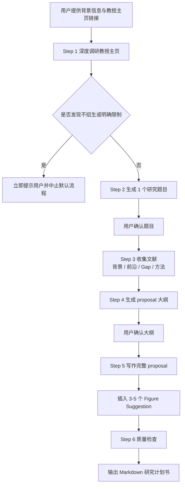

# Research Proposal Skill — 日本大学院研究计划书自动生成 Skill

> **完全免费、完全公开。** 面向希望申请日本大学院修士或博士项目的同学，用来自动完成从教授研究轨迹分析、研究选题拟定、文献框架搭建，到研究计划书写作与质检的完整流程。

## 这个 Skill 是做什么的？

如果说 `academic-cold-email` 解决的是“如何给教授写第一封联系邮件”，那么 **research-proposal-skill** 解决的就是“如何围绕某位教授的研究方向，写出一份真正能用于申请的研究计划书”。它的重点不在于建立联系，而在于把教授的近期研究、你的个人背景，以及一个可执行的研究问题，整合成一份结构完整、逻辑严密、语言规范的 proposal。

这个 Skill 的核心思想并不是“直接让 AI 凭空生成一篇漂亮的长文”，而是先完成教授研究情报分析，再做选题匹配，之后补齐文献、搭建结构，最后才进入正文写作。因此，它更适合已经进入正式申请准备阶段、需要高质量 proposal 草案的用户，而不是仅仅想试探性联系教授的场景。

| 模块 | 它具体做什么 | 典型输出 |
| --- | --- | --- |
| 教授研究情报提取 | 深度浏览教授主页及其子页面，识别当前活跃研究方向、近期论文、项目与招生信息 | 教授研究画像、代表论文、风险提示 |
| 研究方向拟定 | 将教授的研究轨迹与你的技能、项目、论文经历进行交叉匹配 | 1 个具体且可执行的研究题目 |
| 文献收集 | 围绕已确认题目补齐背景、前沿、研究空白与方法论文献 | 可用于写作的文献框架 |
| 大纲生成 | 根据学科类型与申请层次，组织 proposal 的章节结构和论证顺序 | 标准化研究计划书大纲 |
| 正文写作 | 按照学术写作风格，将大纲扩展为完整 proposal | Markdown 格式研究计划书 |
| 质量检查 | 检查结构、逻辑、语言、文献和教授匹配度 | 可继续修改或导出的定稿草案 |

## 什么时候该用？什么时候不该用？

这个 Skill 最适合你已经进入“认真准备申请材料”阶段，而不是还停留在“先试探联系一下教授”阶段的时候使用。只要你的任务目标已经从“建立联系”转向“准备正式研究计划”，它就比 cold-email 类 Skill 更合适。

| 场景 | 是否适合 | 原因 |
| --- | --- | --- |
| 你已经有目标教授主页，想写研究计划书 | 适合 | 这是它的标准使用场景 |
| 你想先给教授发套瓷信 | 不适合 | 这类任务更适合 `academic-cold-email` |
| 你只有一个很模糊的大方向，还没锁定教授 | 一般 | 先缩小方向再用效果更好 |
| 你已经有 proposal 初稿，想让 AI 帮你重构逻辑 | 适合 | 可以把现有想法和材料喂给它继续深化 |
| 你只想让 AI 凭空写一篇“看起来像 proposal 的文章” | 不建议 | 这个 Skill 强调真实匹配与可执行性，不鼓励空泛生成 |

## 这个 Skill 的关键运行细节

为了让生成结果更稳定，**research-proposal-skill** 在内部其实有一套默认执行规则。它默认不会同时给出很多候选题目，而是先给出 **1 个** 明确研究方向供你确认；在教授调研阶段，会尽量提取至少 **2 篇** 具有代表性的近期论文；在最终写作阶段，如果目标是 PhD 级别 proposal，则会默认朝 **40 篇以上参考文献** 的密度去构建文献基础，除非你明确要求减少或另有学校限制。默认字数则大致按 **3000 词左右** 控制，同时在合适位置插入 **3–5 个 Figure Suggestion**，帮助后续继续扩展成更正式的计划书版本。

这也意味着，这个 Skill 并不是“随便输入一句话就秒出终稿”的黑箱工具，而是一个带有两次确认关卡的半结构化流水线。第一次确认发生在研究题目生成之后，第二次确认发生在大纲生成之后。这样设计的目的是降低偏题风险，让真正耗时的正文写作建立在你已经认可的方向和结构之上。

| 细节项 | 默认值或默认行为 | 说明 |
| --- | --- | --- |
| 题目数量 | 1 个 | 先聚焦一个可执行方向，再确认是否继续 |
| 教授代表论文提取 | 至少 2 篇 | 用于判断教授当前研究轨迹，而不是只看旧研究 |
| 默认目标字数 | 约 3000 词 | 可按学校要求改短或改长 |
| Figure Suggestion 数量 | 3–5 个 | 便于后续图示化和继续扩写 |
| 参考文献密度 | PhD 默认 40+ 篇 | 若用户另有要求，可以覆盖默认值 |
| 确认关卡 | 2 次 | 分别在题目确认和大纲确认阶段 |
| 输出格式 | Markdown | 便于继续修改、导出或转存 |

## 这个 Skill 的运行流程图

下面这张流程图展示了 **research-proposal-skill** 的标准执行路径。GitHub 可以直接渲染 Mermaid，因此你在仓库页面中就能看到图形化流程。



## 这个 Skill 的输入与输出是什么？

从使用者角度看，这个 Skill 的输入并不复杂，但为了让结果真正可用，建议尽量把背景信息说具体。尤其是你的项目经验、方法能力、论文经历和目标方向，它们都会直接影响最终题目的可行性与 proposal 的说服力。

| 输入项 | 是否必需 | 作用 |
| --- | --- | --- |
| 申请者姓名 | 建议提供 | 便于个性化描述和文档组织 |
| 当前院校 / 专业 / 年级 | 必需 | 用于判断申请层级与研究基础 |
| 核心技能与经历优势 | 必需 | 决定题目与方法设计是否真实可行 |
| 教授主页链接 | 必需 | 这是教授研究情报提取的起点 |
| 输出语言（英文或中文） | 必需 | 决定最终 proposal 的写作语言 |
| 目标字数 | 可选 | 默认约 3000 词，可按学校要求调整 |
| 已有论文 / PDF / 笔记 | 可选 | 可显著提升文献框架质量 |
| 个人偏好的研究主题 | 可选 | 有助于缩小题目搜索范围 |

输出则不是单一的一段文字，而是一整套逐步生成并收敛后的成果。最核心的最终产物是一个可继续修改的 Markdown 研究计划书，而在这之前，Skill 实际上还会隐式地产生多层中间成果，例如教授研究画像、推荐题目、文献框架和 proposal 大纲。

| 输出层级 | 具体内容 | 是否面向最终用户 |
| --- | --- | --- |
| 中间输出 1 | 教授研究方向、近期论文、招生风险提示 | 是 |
| 中间输出 2 | 1 个建议研究题目 | 是，需要确认 |
| 中间输出 3 | 文献分类框架 | 视交互过程而定 |
| 中间输出 4 | Proposal 大纲 | 是，需要确认 |
| 最终输出 | Markdown 格式研究计划书 | 是 |

## 它和 academic-cold-email 的区别是什么？

这两个 Skill 虽然都服务于日本大学院申请，但解决的问题完全不同。前者更像“建立联系的沟通工具”，后者则是“正式申请材料的生产工具”。如果混用，就容易出现任务目标错位：比如想写 proposal 却只拿到一封邮件，或者想联系教授却得到一篇长文。

| 对比项 | academic-cold-email | research-proposal-skill |
| --- | --- | --- |
| 目标 | 给教授写第一封联系邮件 | 写完整研究计划书 |
| 输出形式 | 中英文邮件草稿 + 调研归档 | Markdown 研究计划书 |
| 核心动作 | 教授调研、套瓷切入点、邮件写作 | 教授调研、选题、文献、结构、proposal 写作 |
| 是否强调文献综述 | 较少 | 很强 |
| 是否有正文结构设计 | 基本没有 | 是核心步骤 |
| 适用阶段 | 前期接触教授 | 正式申请准备 |

## 从下载到使用：完整指南

如果你不熟悉 GitHub，也完全没有关系。这个 Skill 的目录结构已经按公开仓库导入的方式整理好了，可以直接导入，也可以下载后上传。

### 方法一：直接用 GitHub 链接导入

这是最推荐的方式，不需要下载任何文件。

1. 打开 [Manus](https://manus.im)，登录你的账号。
2. 点击左侧菜单中的 **Skills**（技能）标签页。
3. 点击右上角的 **+ Add**（添加）按钮。
4. 选择 **Import from GitHub**（从 GitHub 导入）。
5. 粘贴本仓库地址：

   ```text
   https://github.com/sonnygin/japan-university-exam-guide
   ```

6. Manus 会自动识别仓库中的 Skill 并导入，确认即可。

### 方法二：下载 ZIP 后上传

如果你更习惯先下载到本地再上传，可以按下面的步骤操作。

**第一步：从 GitHub 下载**

1. 打开仓库主页：https://github.com/sonnygin/japan-university-exam-guide
2. 点击绿色的 **Code** 按钮。
3. 在弹出的菜单中点击 **Download ZIP**。
4. 等待下载完成，你会得到一个 `japan-university-exam-guide-main.zip` 文件。

**第二步：解压并找到 Skill 文件夹**

下载并解压后，目录结构大致如下：

```text
japan-university-exam-guide-main/
├── skills/
│   ├── academic-cold-email/
│   └── research-proposal-skill/   <-- 这就是你需要的 Skill 文件夹
│       ├── SKILL.md
│       ├── README.md
│       └── references/
│           ├── STRUCTURE_GUIDE.md
│           ├── WRITING_STYLE_GUIDE.md
│           └── QUALITY_CHECKLIST.md
├── experiences/
├── tips/
├── resources/
└── README.md
```

你需要的是 `skills/research-proposal-skill/` 这个完整文件夹。

**第三步：上传到 Manus**

1. 打开 [Manus](https://manus.im)，登录你的账号。
2. 点击左侧菜单中的 **Skills**（技能）标签页。
3. 点击右上角的 **+ Add**（添加）按钮。
4. 选择 **Upload a skill**（上传技能）。
5. 将 `research-proposal-skill` 文件夹整体拖入上传区域，或者压缩成 ZIP 后再上传。
6. 上传成功后，你会在 Skills 列表中看到 **research-proposal-skill**。

## 导入后怎么使用？

导入后，这个 Skill 的使用方式与其他 Skill 一样：在新对话中通过 `/` 调出，然后把你的申请背景和教授链接发给它即可。为了让生成结果更像“能拿去打磨的正式申请材料”，建议你第一次输入时就把背景写得尽量完整。

你可以参考下面这种启动方式：

```text
/research-proposal-skill

我想申请日本大学院，请基于这位教授的主页帮我生成研究计划书：
https://www.xxx-lab.jp/professor/

我的背景如下：
- 姓名：张三
- 当前状态：某大学计算机专业大四
- 优势：做过多模态分类项目，熟悉 Python、PyTorch、数据标注流程，有一篇校内科研训练论文
- 输出语言：英文
- 目标字数：3000 词左右
```

随后，Skill 一般会先确认你的背景信息是否齐全，再开始逐步执行“教授调研 → 题目确认 → 文献梳理 → 大纲确认 → 正文写作 → 质检交付”的流程。

## 文件结构说明

这个 Skill 被整理成“一个核心说明文件 + 一个面向人类的 README + 三个供 AI 按需加载的参考文件”的形式。这样做的目的，是让 `SKILL.md` 保持简洁，把真正只在特定步骤需要的细节放进 `references/`，既利于维护，也利于导入后稳定使用。

| 文件 | 作用 | 谁在读 |
| --- | --- | --- |
| `SKILL.md` | Skill 的核心指令文件，定义触发条件、工作流程和硬约束 | Manus AI |
| `README.md` | 面向仓库读者的说明文档，解释这个 Skill 的用途、流程、输入输出与使用方法 | 你（人类） |
| `references/STRUCTURE_GUIDE.md` | Proposal 大纲结构指南 | Manus AI |
| `references/WRITING_STYLE_GUIDE.md` | Proposal 正文写作风格指南 | Manus AI |
| `references/QUALITY_CHECKLIST.md` | Proposal 完稿前的质检清单 | Manus AI |

## 这个 Skill 的亮点是什么？

它的最大特点，在于不是把“写 proposal”理解为一次单轮文本生成，而是把它拆成几个真正影响质量的决策环节：教授匹配、选题可行性、文献支撑、结构设计与写作质检。也正因为如此，它生成的内容通常比普通“帮我写一篇研究计划书”的指令更稳定，也更不容易空泛。

| 亮点 | 说明 |
| --- | --- |
| 以教授近期研究为中心 | 不是泛泛围绕一个学科写，而是对齐目标教授的活跃方向 |
| 强调题目确认关卡 | 先确认题目，再写文，减少整篇偏题的风险 |
| 内置文献与结构思维 | 不只是写作文案，而是先搭论证骨架 |
| 支持中英文输出 | 可以根据申请要求输出英文或中文 proposal |
| 默认高密度文献基础 | PhD 场景默认朝 40+ 参考文献的规模准备 |
| 零捏造导向 | 强调论文、研究方向与事实来源必须可追溯 |
| 便于二次修改 | 最终输出为 Markdown，便于继续润色、导出或转存 |

## 常见问题

**Q：这个 Skill 会自动帮我写套瓷信吗？**  
A：不会。这个 Skill 专注于研究计划书写作。如果你的目标是先联系教授，请使用 `academic-cold-email`。

**Q：我只有教授主页，没有自己的明确题目，也能用吗？**  
A：可以，这正是它的主要用途之一。它会先根据教授近期研究和你的背景帮你拟出一个具体题目，再进入 proposal 流程。

**Q：我已经有一个初步选题了，还值得用吗？**  
A：值得。你可以把已有想法一并提供，它会把你的题目与教授研究轨迹重新对齐，并补上文献、结构和表达层面的不足。

**Q：为什么 README 里特别提到 40 篇参考文献？**  
A：这是为了让使用者明确这个 Skill 的默认写作深度。更准确地说，**40+ 参考文献** 是针对 **PhD 级别 proposal** 的默认目标，而不是所有场景都强制如此。若学校要求较短、申请阶段偏早，或者你明确要求缩减，它会按你的要求调整。

**Q：输出一定可靠吗？可以直接提交吗？**  
A：更准确地说，它能给你一个高质量、可继续修改的草案。正式提交前，你仍然应该自己核对学校格式要求、教授方向匹配度，以及所有事实和引用。

**Q：如果教授主页上明确写了不招生怎么办？**  
A：这个 Skill 设计了红线检查。若发现教授明确表示当前不接收学生，流程会优先提示这一点，而不是继续无条件生成看似完整但实际上失去现实意义的 proposal。

## 贡献与反馈

如果你在使用中发现问题，或者希望继续扩展这个 Skill 的参考模板与学科适配规则，欢迎在仓库中提交 Issue 或 Pull Request。
