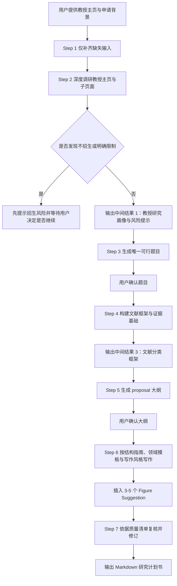

# Research Proposal Skill — 日本大学院教授匹配型研究计划书 Skill

> **完全公开、可复用，并按 MIT 协议开源。** 这个 Skill 用于日本大学院申请场景下的研究计划书生成，不是单纯“帮你写一篇 proposal”，而是先围绕目标教授做真实调研，再将申请者背景、研究空白、方法路径与写作结构逐步收束为一份可继续修改的 Markdown 研究计划书。

## 这个 Skill 现在解决什么问题？

这次更新后的 **research-proposal-skill**，已经不再只是一个通用 proposal 写作器，而是替换为当前正在使用的**教授匹配型研究计划书流程**。它强调的核心不是“快速产出一篇长文”，而是先判断教授近年的真实研究轨迹、招生风险与研究方向，再基于申请者已有背景提出**恰好 1 个**可行题目，之后再进入文献框架、大纲确认与正式写作阶段。

这意味着它尤其适合如下场景：你已经锁定或基本锁定某位日本大学院教授，想要围绕该教授的研究路线准备一份更真实、更有匹配度、同时也更适合面试和后续打磨的研究计划书。相对地，如果你的目标只是先联系教授、试探是否招生，那么更适合使用 `academic-cold-email`，而不是直接调用这个 Skill。

| 模块 | 更新后的核心动作 | 典型输出 |
| --- | --- | --- |
| 信息补全 | 只补问真正缺失的申请信息，不重复盘问已知内容 | 清晰的申请输入集 |
| 教授调研 | 深入教授主页与子页面，识别近期方向、代表成果、招生红线与风险 | 教授研究画像与风险提示 |
| 题目拟定 | 只生成 **1 个** 与教授轨迹和申请者能力同时匹配的题目 | 唯一建议题目 |
| 文献构建 | 按 Background / Current State / Research Gap / Methodology 组织证据基础 | 文献框架 |
| 大纲生成 | 按学科领域、语言和申请层级生成 proposal 大纲 | 可确认的大纲 |
| 正文写作 | 依照结构、领域模板、写作风格与质量清单生成完整草案 | Markdown 研究计划书 |
| 质检交付 | 检查逻辑、语言、文献、方法可行性与教授匹配度 | 可继续修改的正式草案 |

## 它和旧版有什么实质差别？

旧版更接近“研究计划书自动生成器”，而当前版本更强调**教授匹配逻辑**与**流程分阶段收敛**。它有两个不可轻易跳过的确认关口：第一次发生在**唯一研究题目**生成后，第二次发生在**proposal 大纲**生成后。只有在这两个关键节点方向已经基本正确时，才会继续进入正文写作。

同时，当前版本把写作阶段拆解得更细。它会在不同阶段分别调用文献工作流、结构指南、领域模板、写作风格指南和质量检查清单，而不是把所有规则都硬塞进一个总说明文件中。这种设计既更贴近真实申请流程，也更利于后续维护与继续扩展。

| 关键维度 | 当前版本的默认行为 |
| --- | --- |
| 教授匹配 | 优先判断近年轨迹，不围绕过时方向写题目 |
| 招生红线 | 若发现“不接收学生”等明确信号，先提示风险再决定是否继续 |
| 题目数量 | 默认只给 **1 个** 建议题目 |
| 确认关卡 | 题目确认一次，大纲确认一次 |
| 文献组织 | 至少覆盖 Background / Current State / Research Gap / Methodology |
| 学科适配 | 根据 STEM / Humanities / Social Sciences 切换结构重点 |
| 输出格式 | 最终交付干净、可编辑的 Markdown 文件 |

## 运行流程图

下面的 Mermaid 流程图已经按当前 Skill 的真实执行顺序更新。它比旧版多出了“补齐缺失输入”“文献证据构建”“领域模板写作”和“写作后质量复核”等关键环节，也更准确反映了这个 Skill 现在的工作方式。



## 输入与输出

从使用者角度看，这个 Skill 最重要的输入并不在于“你想申请什么专业”这一句宽泛描述，而在于你是否能提供**教授主页**、**自身背景**与**希望输出的语言**。如果这些信息过于空泛，题目匹配和方法设计就很容易失真；反过来，只要输入足够具体，即使你尚未有明确题目，这个 Skill 也能逐步把申请方向收束出来。

| 输入项 | 是否必需 | 作用 |
| --- | --- | --- |
| 当前院校 / 专业 / 年级或当前状态 | 必需 | 判断申请层级与研究准备度 |
| 核心技能与经历优势 | 必需 | 决定题目设计是否真实可行 |
| 教授主页链接 | 必需 | 教授研究画像与风险判断的起点 |
| 输出语言 | 必需 | 决定最终 proposal 的写作语言 |
| 学科领域 | 必需 | 用于切换领域模板 |
| 目标字数 | 可选 | 默认约 3000 词，可按学校要求调整 |
| 既有论文 / PDF / 笔记 | 可选 | 可显著增强文献基础 |
| 主题偏好 | 可选 | 用于缩小题目搜索范围 |

输出也不是一次性冒出的一篇终稿，而是一组逐步确认的中间成果与最终成果。这样的设计，是为了降低“整篇写出来才发现方向错了”的风险。

| 输出层级 | 具体内容 | 是否需要用户确认 |
| --- | --- | --- |
| 中间输出 1 | 教授研究方向、近期代表成果、研究轨迹、招生风险与来源链接 | 否，但用户可据此调整方向 |
| 中间输出 2 | 唯一建议题目，含匹配理由、研究空白与可行方法路径 | 是 |
| 中间输出 3 | 文献分类框架与代表性文献分组 | 视情况而定 |
| 中间输出 4 | Proposal 大纲与章节字数分配 | 是 |
| 最终输出 | Markdown 格式研究计划书 | 交付成果 |

## 和 academic-cold-email 的区别

虽然这两个 Skill 都服务于日本大学院申请，但它们解决的是两个完全不同的问题。`academic-cold-email` 的目标是帮助你完成教授初次联系，强调沟通策略、研究兴趣对接与邮件表达；而 **research-proposal-skill** 的目标是生成正式申请材料，强调教授研究轨迹、题目可行性、文献证据与 proposal 结构本身。因此，如果在申请早期就直接把 proposal Skill 当成套瓷工具使用，往往会让任务目标错位。

| 对比项 | academic-cold-email | research-proposal-skill |
| --- | --- | --- |
| 主要目标 | 给教授写第一封联系邮件 | 写与目标教授匹配的研究计划书 |
| 调研重点 | 沟通切入点、招收可能性、套瓷策略 | 教授近年方向、题目可行性、文献与写作结构 |
| 核心输出 | 中英文邮件草稿与归档信息 | Markdown 研究计划书及其中间成果 |
| 适用阶段 | 申请前期联系教授 | 正式准备申请材料 |
| 是否强调文献与结构 | 相对较少 | 非常强 |

## 仓库中的文件结构

与旧版相比，这次更新后的 Skill 文件夹结构更完整。除了 `SKILL.md` 之外，还新增了文献工作流、领域模板，以及中英文 proposal 脚手架文件，使写作阶段的规则来源更加明确。

```text
skills/research-proposal-skill/
├── SKILL.md
├── README.md
├── references/
│   ├── LITERATURE_WORKFLOW.md
│   ├── STRUCTURE_GUIDE.md
│   ├── DOMAIN_TEMPLATES.md
│   ├── WRITING_STYLE_GUIDE.md
│   └── QUALITY_CHECKLIST.md
└── assets/
    ├── proposal_scaffold_en.md
    └── proposal_scaffold_zh.md
```

| 文件 | 作用 | 面向对象 |
| --- | --- | --- |
| `SKILL.md` | 定义触发条件、工作流、硬约束与确认关卡 | Manus AI |
| `README.md` | 解释这个 Skill 的用途、流程、输入输出与导入方式 | 人类读者 |
| `references/LITERATURE_WORKFLOW.md` | 规范文献收集与分类逻辑 | Manus AI |
| `references/STRUCTURE_GUIDE.md` | 规范 proposal 章节结构与长度分配 | Manus AI |
| `references/DOMAIN_TEMPLATES.md` | 按学科领域切换写作重点 | Manus AI |
| `references/WRITING_STYLE_GUIDE.md` | 提供学术写作风格、hedging 与 figure suggestion 规范 | Manus AI |
| `references/QUALITY_CHECKLIST.md` | 用于正式交付前的自检 | Manus AI |
| `assets/proposal_scaffold_en.md` / `proposal_scaffold_zh.md` | 中英文正文脚手架 | Manus AI |

## 如何导入与使用

如果你通过 GitHub 导入 Skill，最简单的方式仍然是直接导入整个仓库，然后在 Skills 列表中选择 `research-proposal-skill`。如果你更习惯下载后上传，也可以只取 `skills/research-proposal-skill/` 这个文件夹进行导入。

你可以像下面这样启动它：

```text
/research-proposal-skill

请基于下面这位教授的主页，帮我准备日本大学院申请研究计划书：
https://www.xxx-lab.jp/professor/

我的背景如下：
- 当前状态：某大学计算机专业本科四年级
- 核心优势：熟悉 Python、机器学习基础、做过数据处理项目
- 输出语言：英文
- 学科领域：STEM
- 偏好方向：希望尽量贴近大模型或数据驱动方法
```

之后，这个 Skill 通常会按“补齐输入 → 教授调研 → 题目确认 → 文献框架 → 大纲确认 → 正文写作 → 质检交付”的顺序推进，而不是直接跳到最后一步。

## 这次更新后的亮点

当前版本最大的提升，在于它把“研究计划书生成”从一个单点写作动作，提升成了一个更接近真实申请实践的**教授匹配型流程**。这会让最终产出的 proposal 更不容易空泛，也更容易在后续面试、自我介绍或联系教授时保持逻辑一致。

| 亮点 | 说明 |
| --- | --- |
| 强化教授轨迹匹配 | 优先看近年研究，而不是围绕教授早年方向写题目 |
| 保留招生风险检查 | 发现明确不招生时，会先提醒而不是盲写 |
| 题目只给一个 | 有助于把注意力集中在真正可执行的方向上 |
| 文献框架更完整 | 新增文献工作流与领域模板支持 |
| 写作阶段更规范 | 由结构指南、风格指南与质量清单共同约束 |
| 中英文脚手架齐备 | 便于继续扩展为英文正式版或中文参考版 |
| 仍然输出 Markdown | 方便后续继续修改、导出或转存 |

## 常见问题

**Q：这个 Skill 可以不提供教授主页直接使用吗？**  
A：原则上不建议。它的核心价值就在于围绕目标教授进行研究轨迹与招生风险分析；如果没有教授主页，这个 Skill 的优势就很难发挥出来。

**Q：它会一次给我多个备选题目吗？**  
A：默认不会。当前版本会先给出 **1 个** 建议题目，并在你确认后再进入文献与大纲阶段。这样能显著降低偏题概率。

**Q：如果我已经有 proposal 初稿，还值得用吗？**  
A：值得。你可以把现有初稿、PDF 或笔记一并提供，让它围绕教授近年轨迹重新整理文献、结构与论证逻辑。

**Q：这个 Skill 是否只能写英文？**  
A：不是。它可以根据需求输出英文或中文，并在写作阶段调用相应的脚手架与风格规范。

## 说明与许可证

本次仓库版本中的 **research-proposal-skill** 已按当前实际使用中的教授匹配型流程完成替换与更新，并以 **MIT License** 开源发布。另需简单说明的是，这个 Skill 在设计时也参考了 [luwill/research-skills](https://github.com/luwill/research-skills/blob/main/research-proposal/SKILL.md) 中 research-proposal 的部分思路，但当前仓库版本已根据日本大学院教授匹配申请场景进行了完整重构与扩展。
