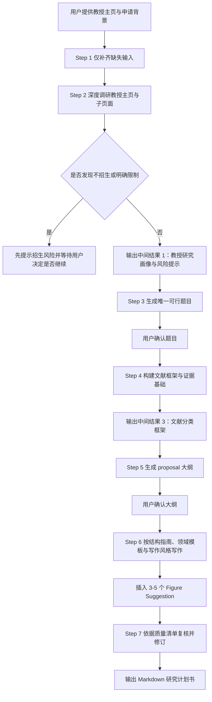

# Research Proposal Skill — 日本大学院教授匹配型研究计划书 Skill

> **完全公开、可复用，并按 MIT 协议开源。** 这个 Skill 面向日本大学院申请中的研究计划书准备场景。它的工作重点不是单纯生成一篇看起来像 proposal 的长文，而是围绕目标教授进行真实调研，再将申请者背景、研究空白、方法设计和写作结构逐步组织成一份可继续修改的 Markdown 研究计划书。

## 这个 Skill 是做什么的？

**research-proposal-skill** 适用于你已经有明确目标教授，或者至少已经锁定了想申请的研究室，希望围绕对方的近年研究方向来准备研究计划书的情形。这个 Skill 会先读取并分析教授主页及其子页面，整理教授近期研究轨迹、代表成果和潜在招生风险；随后，结合申请者的教育背景、项目经历、方法能力与兴趣边界，提出 **1 个** 可执行且匹配度较高的研究题目；在此基础上，它会继续构建文献框架、生成 proposal 大纲，并最终写出一份结构完整、逻辑连贯、便于继续打磨的研究计划书草案。

它适合认真准备申请材料的阶段，而不是仅仅想先发一封联系邮件的阶段。如果你的首要任务是给教授写第一封套瓷信，那么更适合使用 `academic-cold-email`；如果你的首要任务是写与目标教授高度匹配的研究计划书，那么就应使用这个 Skill。

| 模块 | 核心动作 | 典型输出 |
| --- | --- | --- |
| 信息补全 | 只补问真正缺失的申请信息，避免重复询问 | 清晰的申请输入集 |
| 教授调研 | 深入教授主页与子页面，识别近期方向、代表成果与招生风险 | 教授研究画像与风险提示 |
| 题目拟定 | 生成 **1 个** 与教授轨迹和申请者能力同时匹配的题目 | 唯一建议题目 |
| 文献构建 | 按 Background / Current State / Research Gap / Methodology 组织证据基础 | 文献框架 |
| 大纲生成 | 按学科领域、申请层级和输出语言生成 proposal 大纲 | 可确认的大纲 |
| 正文写作 | 依照结构指南、领域模板与写作风格生成完整草案 | Markdown 研究计划书 |
| 质量复核 | 检查结构、语言、文献、方法可行性与教授匹配度 | 可继续修改的正式草案 |

## 工作流程

这个 Skill 采用分阶段收敛的方式推进，而不是直接一步写出终稿。这样做的原因很简单：研究计划书质量通常不取决于“文字是否流畅”，而更取决于教授方向是否看准、题目是否可行、文献是否成体系、结构是否合适。因此，它在真正动笔之前，会先完成教授调研、题目确认与大纲确认。

其中有两个关键确认关口。第一个发生在**唯一研究题目**生成之后，第二个发生在**proposal 大纲**生成之后。只有在这两个方向性节点都基本没有偏差时，才会继续进入正式写作。

| 关键维度 | 默认行为 |
| --- | --- |
| 教授匹配 | 优先依据近年研究轨迹判断题目方向 |
| 招生红线 | 若发现“不接收学生”等明确信号，会先提示风险 |
| 题目数量 | 默认只给 **1 个** 建议题目 |
| 确认关卡 | 题目确认一次，大纲确认一次 |
| 文献组织 | 至少覆盖 Background / Current State / Research Gap / Methodology |
| 学科适配 | 根据 STEM / Humanities / Social Sciences 切换结构重点 |
| 输出格式 | 最终交付干净、可编辑的 Markdown 文件 |

## 运行流程图

下面的 Mermaid 流程图展示了这个 Skill 的标准执行顺序。GitHub 可以直接渲染 Mermaid，因此在仓库页面中即可看到图形化流程。



## 输入与输出

从使用者角度看，这个 Skill 最重要的输入并不只是“想申请什么方向”这样一句宽泛描述，而是**教授主页**、**自身背景**与**输出要求**。这些信息越具体，最终题目与 proposal 的可行性就越高。即使你暂时还没有非常明确的研究题目，只要能够说清楚自己的训练背景和兴趣边界，这个 Skill 也能帮助你逐步把方向收束出来。

| 输入项 | 是否必需 | 作用 |
| --- | --- | --- |
| 当前院校 / 专业 / 年级或当前状态 | 必需 | 判断申请层级与研究准备度 |
| 核心技能与经历优势 | 必需 | 决定题目设计是否真实可行 |
| 教授主页链接 | 必需 | 教授研究画像与风险判断的起点 |
| 输出语言 | 必需 | 决定最终 proposal 的写作语言 |
| 学科领域 | 必需 | 用于切换领域模板 |
| 目标字数 | 可选 | 默认约 3000 词，可按学校要求调整 |
| 既有论文 / PDF / 笔记 | 可选 | 可显著增强文献基础 |
| 主题偏好 | 可选 | 用于缩小题目搜索范围 |

这个 Skill 的输出也不是一次性出现的一篇终稿，而是一组逐步确认的中间成果与最终成果。这样的设计可以有效降低“整篇写完才发现方向错了”的风险。

| 输出层级 | 具体内容 | 是否需要用户确认 |
| --- | --- | --- |
| 中间输出 1 | 教授研究方向、近期代表成果、研究轨迹、招生风险与来源链接 | 否，但用户可据此调整方向 |
| 中间输出 2 | 唯一建议题目，含匹配理由、研究空白与可行方法路径 | 是 |
| 中间输出 3 | 文献分类框架与代表性文献分组 | 视情况而定 |
| 中间输出 4 | Proposal 大纲与章节字数分配 | 是 |
| 最终输出 | Markdown 格式研究计划书 | 交付成果 |

## 与 academic-cold-email 的区别

虽然这两个 Skill 都服务于日本大学院申请，但它们解决的问题并不相同。`academic-cold-email` 的目标是帮助你完成教授初次联系，重点在于沟通切入点、表达方式与联系策略；而 **research-proposal-skill** 的目标是生成正式申请材料，重点在于教授研究轨迹、题目可行性、文献证据和 proposal 结构本身。因此，如果你当前的任务是准备申请材料，就应优先使用这个 Skill；如果你当前的任务是联系教授，则应优先使用套瓷信相关 Skill。

| 对比项 | academic-cold-email | research-proposal-skill |
| --- | --- | --- |
| 主要目标 | 给教授写第一封联系邮件 | 写与目标教授匹配的研究计划书 |
| 调研重点 | 沟通切入点、招收可能性、套瓷策略 | 教授近年方向、题目可行性、文献与写作结构 |
| 核心输出 | 中英文邮件草稿与归档信息 | Markdown 研究计划书及其中间成果 |
| 适用阶段 | 申请前期联系教授 | 正式准备申请材料 |
| 是否强调文献与结构 | 相对较少 | 非常强 |

## 文件结构

这个 Skill 采用“一个核心说明文件 + 一组按需读取的参考文件 + 中英文脚手架”的组织方式。这样可以让 `SKILL.md` 保持聚焦，把真正只在某些阶段需要的细则放在 `references/` 和 `assets/` 中，既利于维护，也有助于导入后的稳定使用。

```text
skills/research-proposal-skill/
├── SKILL.md
├── README.md
├── references/
│   ├── LITERATURE_WORKFLOW.md
│   ├── STRUCTURE_GUIDE.md
│   ├── DOMAIN_TEMPLATES.md
│   ├── WRITING_STYLE_GUIDE.md
│   └── QUALITY_CHECKLIST.md
└── assets/
    ├── proposal_scaffold_en.md
    └── proposal_scaffold_zh.md
```

| 文件 | 作用 | 面向对象 |
| --- | --- | --- |
| `SKILL.md` | 定义触发条件、工作流、硬约束与确认关卡 | Manus AI |
| `README.md` | 解释 Skill 的用途、流程、输入输出与导入方式 | 人类读者 |
| `references/LITERATURE_WORKFLOW.md` | 规范文献收集与分类逻辑 | Manus AI |
| `references/STRUCTURE_GUIDE.md` | 规范 proposal 章节结构与长度分配 | Manus AI |
| `references/DOMAIN_TEMPLATES.md` | 按学科领域切换写作重点 | Manus AI |
| `references/WRITING_STYLE_GUIDE.md` | 提供学术写作风格、hedging 与 Figure Suggestion 规范 | Manus AI |
| `references/QUALITY_CHECKLIST.md` | 用于正式交付前的自检 | Manus AI |
| `assets/proposal_scaffold_en.md` / `proposal_scaffold_zh.md` | 中英文正文脚手架 | Manus AI |

## 如何导入与使用

如果你通过 GitHub 导入 Skill，最简单的方式是直接导入整个仓库，然后在 Skills 列表中选择 `research-proposal-skill`。如果你更习惯下载后上传，也可以只取 `skills/research-proposal-skill/` 这个文件夹进行导入。

你可以像下面这样启动它：

```text
/research-proposal-skill

请基于下面这位教授的主页，帮我准备日本大学院申请研究计划书：
https://www.xxx-lab.jp/professor/

我的背景如下：
- 当前状态：某大学计算机专业本科四年级
- 核心优势：熟悉 Python、机器学习基础、做过数据处理项目
- 输出语言：英文
- 学科领域：STEM
- 偏好方向：希望尽量贴近大模型或数据驱动方法
```

之后，这个 Skill 通常会按“补齐输入 → 教授调研 → 题目确认 → 文献框架 → 大纲确认 → 正文写作 → 质检交付”的顺序推进。

## 这个 Skill 的特点

这个 Skill 的最大特点，在于它把研究计划书写作视为一个**教授匹配、题目筛选、文献组织、结构设计与正式写作**共同构成的过程，而不是简单的一次性文本生成。这样的流程更接近真实申请中的材料准备方式，也更有利于后续继续修改、压缩字数、准备面试和统一申请叙事。

| 特点 | 说明 |
| --- | --- |
| 强调教授轨迹匹配 | 优先依据教授近年研究方向组织题目与方法 |
| 保留招生风险检查 | 发现明确不招生时，会先提醒而不是盲写 |
| 题目只给一个 | 有助于把注意力集中在真正可执行的方向上 |
| 文献框架完整 | 覆盖背景、前沿、研究空白与方法层文献 |
| 写作阶段规范 | 由结构指南、风格指南与质量清单共同约束 |
| 中英文支持 | 可根据需求输出英文或中文，并调用对应脚手架 |
| 输出可继续编辑 | 最终交付 Markdown，便于后续修改、导出或转存 |

## 常见问题

**Q：这个 Skill 可以不提供教授主页直接使用吗？**  
A：原则上不建议。它的核心价值就在于围绕目标教授进行研究轨迹与招生风险分析；如果没有教授主页，这个 Skill 的优势就很难发挥出来。

**Q：它会一次给我多个备选题目吗？**  
A：默认不会。它会先给出 **1 个** 建议题目，并在你确认后再进入文献与大纲阶段。这样能显著降低偏题概率。

**Q：如果我已经有 proposal 初稿，还值得用吗？**  
A：值得。你可以把现有初稿、PDF 或笔记一并提供，让它围绕教授近年轨迹重新整理文献、结构与论证逻辑。

**Q：这个 Skill 是否只能写英文？**  
A：不是。它可以根据需求输出英文或中文，并在写作阶段调用相应的脚手架与风格规范。

## 说明与许可证

本仓库中的 **research-proposal-skill** 以 **MIT License** 开源发布。另需简单说明的是，这个 Skill 在设计时也参考了 [luwill/research-skills](https://github.com/luwill/research-skills/blob/main/research-proposal/SKILL.md) 中 research-proposal 的部分思路，但这里的流程与组织方式已经围绕日本大学院教授匹配申请场景进行了独立整理。
